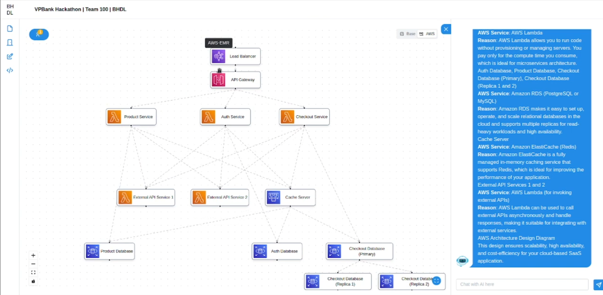
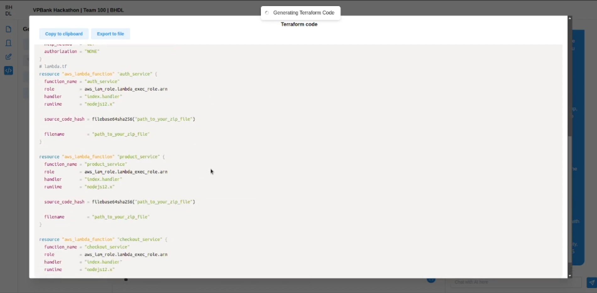

# bhdl.online frontend 

**bhdl.online** is an application designed to provide various functionalities to help users create and manage architecture design diagram more effectively. With the power of ChatGPT 4, out application can provide users ability to create architecture design from scratch with a more interactive and user-friendly experience. 

**Main features**

- Utilizes ChatGPT 4 to turn user's ideas into architecture design diagrams
- Ability to create, edit, explain and manage architecture design diagrams
- Export diagram to various diagram formats (Mermaid, DrawIO)
- Generate code snippets from architecture design diagrams (Terraform, Ansible)
- Ability to handle multiple user use same diagram at the same time

# bhdl.online frontend

This repository contains the frontend code for the bhdl.online application. This is one of the three components of the bhdl.online project. The other two components are:
- [bhdl.online backend](https://github.com/bhdl-ai/vpbank-hackathon-be)
- [bhdl.online ai core](https://github.com/bhdl-ai/vpbank-hackathon-ai)

## Build with

- [Vite](https://vitejs.dev): Frontend build tool
- [React](https://react.dev): Frontend framework to build the user interface
- [Reactflow](https://reactflow.dev): React library for building node-based graphs
- [TailwindCSS](https://tailwindcss.com): Utility-first CSS framework
- [Mantine](https://mantine.dev): React components and hooks library
- [Zustand](https://zustand.surge.sh): State management library

## Getting Started

1. Make sure you already have the [bhdl.online ai core](https://github.com/bhdl-ai/vpbank-hackathon-ai) abd [bhdl.online be](https://github.com/bhdl-ai/vpbank-hackathon-be) running
2. Install the required dependencies using `npm i`
3. Create your own `.env` file based on the `.env.example` file
4. Run the frontend using `npm run dev` 

Now the frontend should be running on `http://localhost:5173/`

## Owner

- [DAN3002](https://github.com/DAN3002)
- [thaiminhpv](https://github.com/thaiminhpv)
- [qwerty22121998](https://github.com/qwerty22121998)
- [khuatdev](https://github.com/khuatdev)
- [LiusDev](https://github.com/LiusDev)
